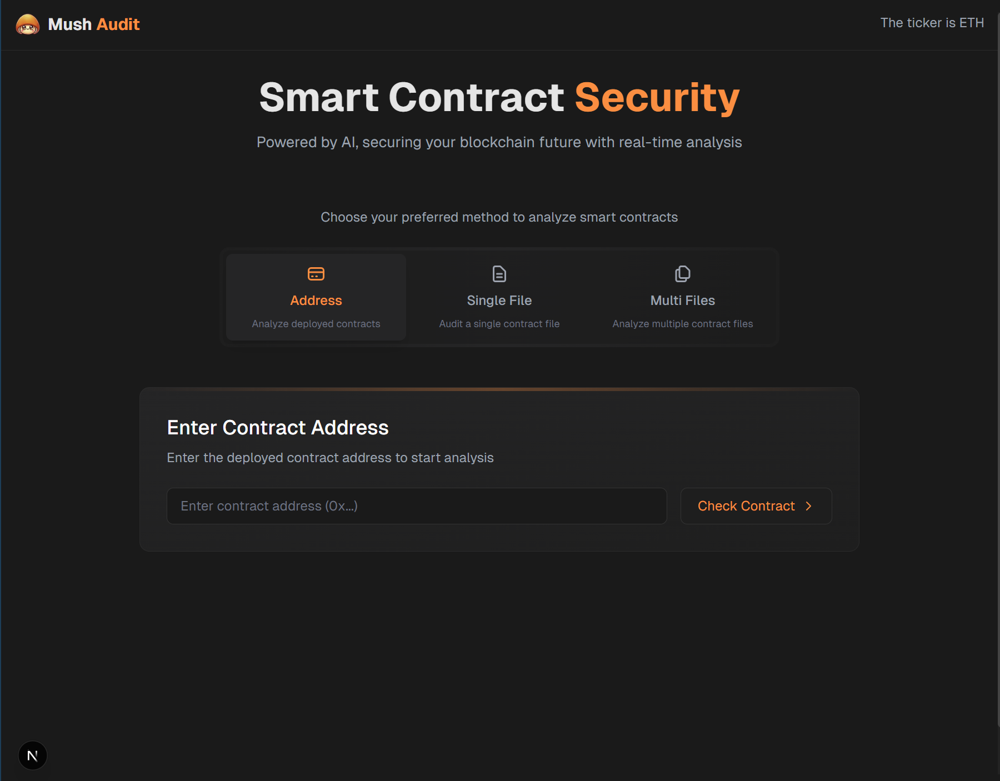
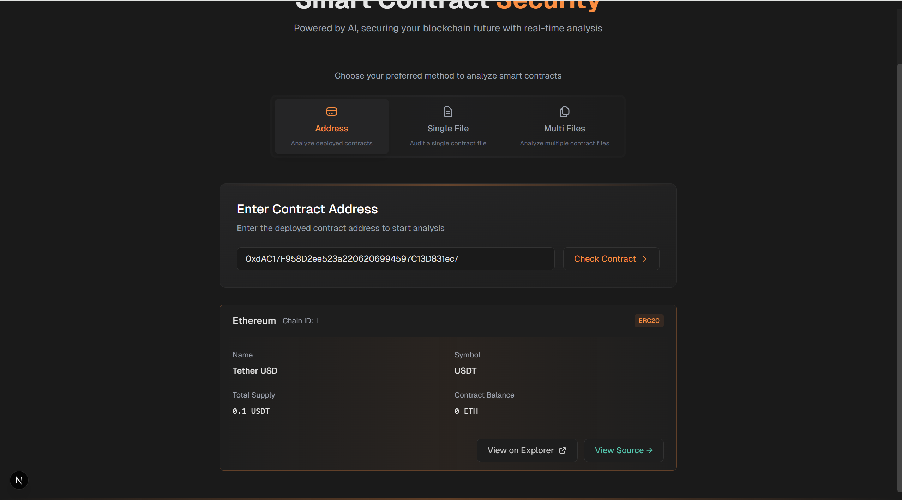

我已分析完毕

##### 你需要知道以下信息：

1. 进入http://localhost:3000/audit 后页面如下

   

​	html文件见：Mush Audit - Smart Contract Security Platform.html

2. 操作真实流程如下：

   1. 在”Enter Contract Address
     Enter the deployed contract address to start analysis"框中输入地址0xdAC17F958D2ee523a2206206994597C13D831ec7
   2. 点击输入框右侧的Check Contract按钮
   3. 程序会自动分析该地址所在链（不需要自己选择Ethereum），Check Contract结果如下，

   ```
   ethereum
   Chain ID: 1
   ERC20
   Name
   Tether USD
   Symbol
   USDT
   Total Supply
   0.1 USDT
   Contract Balance
   0 ETH
   View on Explorer
   View Source →
   ```

   

2. 

   4. 点击View Source →，进入页面http://localhost:3000/audit/source?address=0xdAC17F958D2ee523a2206206994597C13D831ec7&chain=ethereum&tokenName=Tether+USD如下（顶栏右侧有四个按钮，

      View on Blockscan
      Download Source
      ●Slither Online
      Dual Engine Analysis）

      html详情页见

      ```
      Mush Audit - Smart Contract Security Platform-View Source .html
      ```

   5. 点击该页面的Dual Engine Analysis，
      开始分析，AI分析完成后，程序没有识别到AI已分析完成而是继续等待，需要操作者点击结束分析，它才会生成报告，否则操作者会以为他没有分析完成，会一直等下去（大于10min）。 这个原因也有可能是AI分析的时间过长。（slither分析很快，1s）

   6. 点击cancel analyse，才可能会生成分析结果的md

   7. 点击cancel analyse后可能会出现报错

      ```
      ## Error Type
      Console AbortError
      
      ## Error Message
      signal is aborted without reason
      
      
          at handleCancelAnalysis (src/components/audit/SourcePreview.tsx:470:23)
      
      ## Code Frame
        468 |   const handleCancelAnalysis = () => {
        469 |     if (abortController) {
      > 470 |       abortController.abort();
            |                       ^
        471 |     }
        472 |   };
        473 |
      
      Next.js version: 16.1.6 (Turbopack)
      
      ```

      ```
      ## Error Type
      Console Error
      
      ## Error Message
      Analysis cancelled
      
      
          at analyzeContract (src/services/audit/contractAnalyzer.ts:171:15)
          at async (src/services/audit/dualEngineAnalyzer.ts:87:22)
          at async analyzeDualEngine (src/services/audit/dualEngineAnalyzer.ts:101:3)
          at async handleStartAnalysis (src/components/audit/SourcePreview.tsx:379:28)
      
      ## Code Frame
        169 |         params.signal?.aborted
        170 |       ) {
      > 171 |         throw new Error("Analysis cancelled");
            |               ^
        172 |       }
        173 |       lastError = error;
        174 |       retryCount++;
      
      Next.js version: 16.1.6 (Turbopack)
      
      ```

      ```
      ## Error Type
      Console Error
      
      ## Error Message
      Neversight API request failed: 402 . Details: {"error":{"message":"Insufficient balance. Your balance: $0.741743.","type":"api_error","code":"error","trace_id":"f2008e95-7863-46d6-a37e-f872343eb95b"}}
      
      
          at analyzeWithAI (src/utils/ai.ts:125:13)
          at async analyzeContract (src/services/audit/contractAnalyzer.ts:136:26)
          at async (src/services/audit/dualEngineAnalyzer.ts:87:22)
          at async analyzeDualEngine (src/services/audit/dualEngineAnalyzer.ts:101:3)
          at async handleStartAnalysis (src/components/audit/SourcePreview.tsx:379:28)
      
      ## Code Frame
        123 |     if (!response?.ok) {
        124 |       const errorData = await response.text();
      > 125 |       throw new Error(
            |             ^
        126 |         `Neversight API request failed: ${response.status} ${response.statusText}. Details: ${errorData}`
        127 |       );
        128 |     }
      
      Next.js version: 16.1.6 (Turbopack)
      
      ```

      ```
      ## Error Type
      Console Error
      
      ## Error Message
      Neversight API request failed: 402 . Details: {"error":{"message":"Insufficient balance. Your balance: $0.741743.","type":"api_error","code":"error","trace_id":"61518453-f236-42a9-8107-73a50579aeb2"}}
      
      
          at analyzeWithAI (src/utils/ai.ts:125:13)
          at async analyzeContract (src/services/audit/contractAnalyzer.ts:136:26)
          at async (src/services/audit/dualEngineAnalyzer.ts:87:22)
          at async analyzeDualEngine (src/services/audit/dualEngineAnalyzer.ts:101:3)
          at async handleStartAnalysis (src/components/audit/SourcePreview.tsx:379:28)
      
      ## Code Frame
        123 |     if (!response?.ok) {
        124 |       const errorData = await response.text();
      > 125 |       throw new Error(
            |             ^
        126 |         `Neversight API request failed: ${response.status} ${response.statusText}. Details: ${errorData}`
        127 |       );
        128 |     }
      
      Next.js version: 16.1.6 (Turbopack)
      
      ```

      

   8. 点击Download Source，会下载为zip文件，我已解压缩到"E:\Security-Attack-Defense\blockchain\mush-audit-main\测试记录\Tether USD-source"

##### 待解决的问题

1. AI分析等待时间过长，给出这个AI分析代码的大概时间范围
2. 不知道AI分析到哪一步了
3. 分析文件在服务器中的保存位置（in other words，文件下载是从服务器什么位置下载的
4. UI改变为绿色的藤曼标志，其他主题配合优化
5. 你可以补充